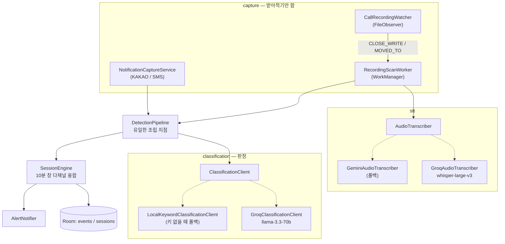
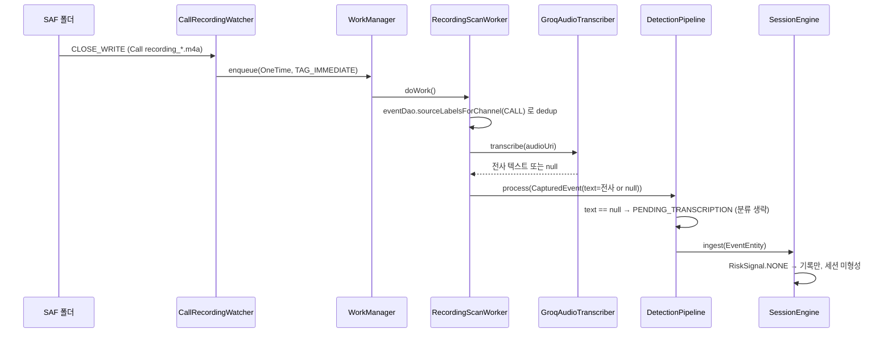
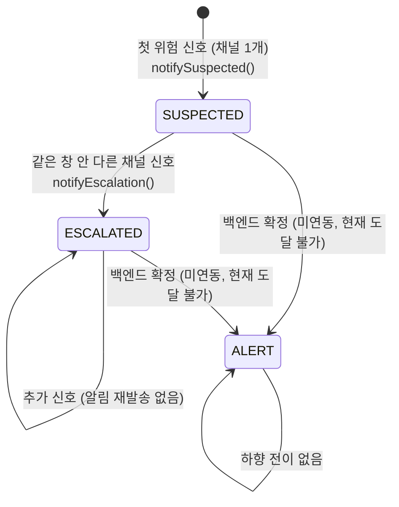

# 시스템 아키텍처

## 계층 구조

캡처 → 분류 → 세션 융합 → 알림. 각 계층은 인접 계층만 알고, 서로의 구현을 모른다.

## 통화 녹음 채널 시퀀스

`RecordingScanWorker`는 15분 주기(`UNIQUE_WORK_NAME = "recording_scan"`)로도 돌지만, 실사용 경로는
`FileObserver`의 즉시 실행이다. 주기 실행은 앱이 죽어 있던 동안 쌓인 파일을 뒤늦게 줍는 안전망이다.

## 세션 상태 전이

핵심 설계 의도: **다채널 여부는 "알릴지 말지"의 문이 아니라 "얼마나 급하게 알릴지"의 강도 조절기다.**
채널 하나만으로도 즉시 `SUSPECTED` + 알림이 나간다. 통화 한 건으로 끝나는 보이스피싱을 놓치지 않기 위한 결정.

## 세션 융합 규칙 (`SessionEngine.fuseIntoSession`)

| 항목 | 규칙 | 이유 |
|------|------|------|
| 시간 창 기준 | `event.capturedAt` (발생 시각), `now()` 아님 | 통화 채널은 STT 때문에 최대 15분 지연 — 처리 시각을 쓰면 실제로 가까웠던 이벤트가 안 엮인다 |
| 창 연장 | `maxOf(기존 windowExpiresAt, capturedAt + 10분)` | 뒤늦게 처리된 과거 이벤트가 이미 늘어난 창을 되레 줄이면 안 됨 |
| 동시성 | `Mutex`로 "활성 세션 조회 → 갱신/생성" 직렬화 | 없으면 두 이벤트가 각자 "활성 세션 없음"으로 보고 세션을 쪼개 격상이 안 일어남 |
| 상대 스코프 | `counterpart`가 있으면 같은 상대 또는 아직 안 좁혀진 세션에만 합류 | 무관한 두 사람이 시간만 겹쳐 한 세션으로 섞이는 것 방지 |
| 통화의 counterpart | 항상 `null` → 아무 활성 세션에나 합류 | `READ_CALL_LOG`를 쓰지 않기로 한 결정의 대가 |

## 데모 경로가 실제 경로와 같은 이유

`DemoInjector.injectKakao()/injectSms()`는 파이프라인을 직접 호출하지 않는다.
**Proto 앱이 자기 이름으로 Android 알림을 띄우고**, `NotificationCaptureService`가 그걸 다시 잡는다.
따라서 데모 버튼도 실제 카카오톡·문자 수신과 완전히 동일한 코드 경로를 탄다.
채널 구분은 알림 extras의 `demo_channel` 힌트로 한다.

통화 채널에는 주입할 것이 없다. 사용자가 연결한 폴더에 파일을 넣으면 `FileObserver`가 잡고,
시뮬레이션 탭의 `통화 전사본 [분석]`은 그 폴더를 **강제로 다시** 훑을 뿐이다
(`RecordingScanWorker`의 `KEY_FORCE`).

`.txt`는 이미 전사된 통화로 보고 STT를 건너뛴다 — 실기기 녹음 없이 전사 직후 지점부터
실제 경로를 그대로 태우기 위한 통로다. 예전에는 앱에 박힌 샘플 음성(`res/raw/demo_call.m4a`)을
복사했는데, 빈 파일이 먼저 노출되어 STT가 실패하고 그대로 굳는 문제가 있어 걷어냈다.
